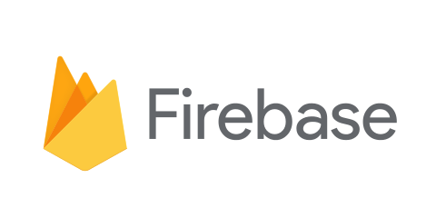

# Firebase Fundamentals

## Intro to Firebase

* [What is Firebase](https://youtu.be/Lz1R4QDbMJc)
* [Firebase Overview](https://youtu.be/mi1GtQ5xn2M)
* [Using the Firebase SDK](https://youtu.be/dWwCq8eB3ec)
* [How to Structure Firebase](https://youtu.be/wEcXYxjGN9o)
* [Firebase Database Rules](https://youtu.be/ycu1zZ_uHF8)

## Firebase Features

### Getting started

* [Introducing Firebase (video)](https://youtu.be/O17OWyx08Cg?list=PLl-K7zZEsYLmOF_07IayrTntevxtbUxDL)
* [Add Firebase to your JavaScript Project (docs)](https://firebase.google.com/docs/web/setup)
* [Add Firebase to your JavaScript Project (video)](https://youtu.be/k1D0_wFlXgo?list=PLl-K7zZEsYLmnJ_FpMOZgyg6XcIGBu2OX)

### Realtime Database

* [Introducing Firebase Realtime Database (video)](https://youtu.be/U5aeM5dvUpA?list=PLl-K7zZEsYLmgdxMEHar35Wo26fLWm9BI)
* [Realtime Database (docs)](https://firebase.google.com/docs/database/)
* [Realtime Database - Web (docs)](https://firebase.google.com/docs/database/web/start)
* [Getting Started with the Firebase Realtime Database on the Web, Part 1 (video)](https://youtu.be/noB98K6A0TY?list=PLl-K7zZEsYLmnJ_FpMOZgyg6XcIGBu2OX)
* [Getting Started with the Firebase Realtime Database on the Web, Part 2 (video)](https://youtu.be/dBscwaqNPuk?list=PLl-K7zZEsYLmnJ_FpMOZgyg6XcIGBu2OX)
* [Firebase 3.0 Queries (video)](https://youtu.be/GVUHx8AQgjg?list=PLdssc-pDiZ7OD78kJVp4habTynj-Etwhm)
* [Firebase 3.0 Data Modeling (video)](https://youtu.be/9gnvC-xIDgs?list=PLdssc-pDiZ7OD78kJVp4habTynj-Etwhm)
* [Firebase 3.0 Security Rules (video)](https://youtu.be/fwDK6E1j9nc?list=PLdssc-pDiZ7OD78kJVp4habTynj-Etwhm)

### Authentication

* [Introducing Firebase Authentication (video)](https://youtu.be/8sGY55yxicA?list=PLl-K7zZEsYLnq6DvMtUJVDLe4w5wcTwUl)
* [Firebase Authentication (docs)](https://firebase.google.com/docs/auth/)
* [Authentication with email and password (docs)](https://firebase.google.com/docs/auth/web/password-auth)
* [Getting started with Firebase Auth on the Web (video)](https://youtu.be/-OKrloDzGpU?list=PLl-K7zZEsYLnq6DvMtUJVDLe4w5wcTwUl)
* [Firebase 3.0 Authentication (video)](https://youtu.be/b9AsH0xIGQc?list=PLdssc-pDiZ7OD78kJVp4habTynj-Etwhm)
* [Authentication Persistence (docs)](https://firebase.google.com/docs/auth/web/auth-state-persistence)

### Cloud Messaging

* [Introducing Firebase Cloud Messaging](https://youtu.be/sioEY4tWmLI?list=PLl-K7zZEsYLmOF_07IayrTntevxtbUxDL)
* [Getting Started with Firebase Cloud Messaging on the Web (video)](https://youtu.be/BsCBCudx58g?list=PLdssc-pDiZ7NOf5gFkWU-e64HLZAYj00E)
* [Firebase Cloud Messaging (docs)](https://firebase.google.com/docs/cloud-messaging/js/client)

### Hosting

* [Getting Started with Firebase Hosting on the Web (video)](https://youtu.be/meofoNuK3vo?list=PLdssc-pDiZ7NOf5gFkWU-e64HLZAYj00E)
* [Get Started with Hosting (docs)](https://firebase.google.com/docs/hosting/quickstart)

### Storage

* [Getting Started with Firebase Storage on the Web (video)](https://youtu.be/SpxHVrpfGgU?list=PLdssc-pDiZ7NOf5gFkWU-e64HLZAYj00E)
* [Get Started with Storage (docs)](https://firebase.google.com/docs/storage/web/start)

## Firebase playlists by [Chris Esplin](https://medium.com/@ChrisEsplin)

* [How To Firebase](https://youtu.be/suCBsEI-Lo0?list=PLdssc-pDiZ7MJeKr4k5r33jCGOT2H_iKB)
* [Firebase 3.0 for Web](https://youtu.be/G_FlX41qADE?list=PLdssc-pDiZ7OD78kJVp4habTynj-Etwhm)

## Firebase and React basics

* [Getting Started with React and Firebase, Part 1 (video)](https://youtu.be/mwNATxfUsgI?list=PLl-K7zZEsYLmnJ_FpMOZgyg6XcIGBu2OX)
* [Getting Started with React and Firebase, Part 2 (video)](https://youtu.be/p4XTMvagQ2Q?list=PLl-K7zZEsYLmnJ_FpMOZgyg6XcIGBu2OX)
